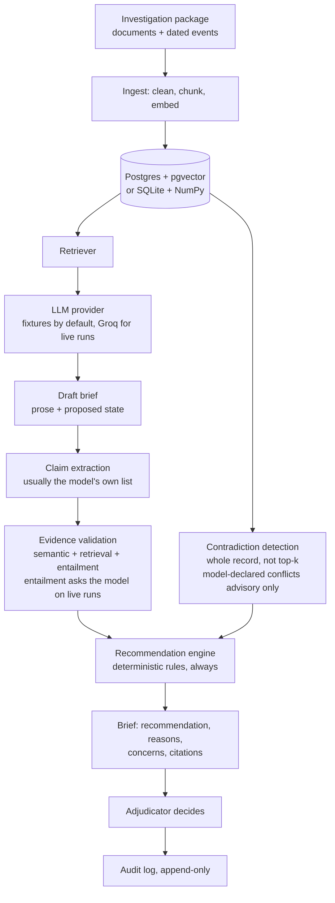

# CaseBrief

CaseBrief takes a completed background investigation package and produces a decision-ready brief
for a human adjudicator: one recommendation, the reasons behind it, and a link from every
statement to the exact passage in the case file that supports it.

All data is synthetic. The system makes no determination about any real person and does not grant
or deny anything.

## The problem

An adjudicator gets a dozen documents from different sources, written at different times, that
overlap and sometimes disagree. They have to read all of it, because the paragraph that matters
could be anywhere.

An LLM can summarise that in seconds, and the summary is useless on its own. You cannot tell which
sentence came from which document, which came from nowhere, where two sources conflict, or what the
file is missing. That moves the work from reading the file to checking the model.

So the brief answers a narrower question: what is the recommended next step, why, and what evidence
backs it.

## Recommendation states

Three states, and none of them is a decision.

| State | Meaning |
| --- | --- |
| Proceed to Standard Review | Every concern has verifiable mitigating evidence and nothing material is in conflict |
| Request Additional Information | The package is missing evidence needed to close a concern, or a claimed mitigation cannot be verified |
| Escalate for Enhanced Review | Two independent records disagree on a material fact, or an adverse finding has no mitigation |

Approve, deny, grant and reject do not exist in the schema, the prompt or the UI. A test asserts
that, and `requires_human_decision` is forced true by a validator the model cannot override.

## Architecture



### Layers

Calls go one direction only. Nothing skips a layer.

| Layer | Path | Responsibility |
| --- | --- | --- |
| Pages | `pages/` | Layout and input. No SQL, no LLM calls, no scoring. |
| Services | `src/services/` | Orchestration: ingest a case, run an analysis, resolve a citation, record a decision |
| Assurance | `src/assurance/` | Claim validation, contradiction detection, the rule engine, metrics |
| Retrieval | `src/retrieval/`, `src/ingestion/` | Chunking, embeddings, vector search |
| LLM | `src/llm/` | Provider adapters and versioned prompts |
| Data | `src/database/` | Models and repositories. The only code that touches the database. |

### One analysis run

1. Retrieve passages for the case across a set of standing adjudication queries, merged by best score.
2. Generate a draft brief from those passages only, under prompt `FINAL_CASE_ASSESSMENT_V1`.
3. Parse it into a Pydantic schema. Citations pointing at passages that are not in the package are
   dropped before anything is scored.
4. Split the draft into atomic claims.
5. Score each claim against its own evidence pool.
6. Detect contradictions across the whole case record.
7. Run the rules. They decide the state.
8. Persist the brief, the claims, the evidence links and the metrics, and write the audit events.

With fixtures, step 2 is the only place a model appears. On a live run there are three more, and
it is worth being precise about them.

Claim extraction is usually not a model call at all: if the draft already carries its claims, they
are used as they are. Only when it does not, and a live provider is configured, is a second call
made to split the prose.

Evidence validation swaps the entailment signal for a model verdict on a live run. The other two
signals stay as code, so no claim is ever scored by the model alone.

Contradiction detection always folds in conflicts the model declared in its own output, and a live
run adds a separate contradiction pass. Both are advisory. Neither can escalate a case.

Step 7 is code in every mode. The rules decide the state, and nothing the model says reaches that
decision except as an input the rules weigh.

### Where the model stops

The model writes prose and proposes a state. The rules decide the state that ships. If they
disagree, the more conservative state ships and the disagreement is shown in the UI and written to
the audit log.

Anything the model asserts about a conflict is advisory. It can trigger a request for more
information; it cannot escalate on its own. Only the deterministic detector escalates. That rule
exists because of a live run, described below.

## How the rules work

Every claim, finding, contradiction and gap is filed into one of seven categories: financial,
employment, foreign travel, identity, monitoring, legal conduct, documentation. Per category the
engine works out the concern level, whether verifiable mitigation exists, what is unresolved, and
how much is unsupported.

Rules are independent. Each one that fires proposes a state, and the most escalated proposal wins.
There is no averaging; one material trigger is enough.

Escalate when: two different records disagree on a material fact; a high-concern category has no
verifiable mitigation; two or more categories carry unmitigated findings; or a claim is
contradicted by the evidence retrieved to support it.

Request information when: a high concern is built from gaps rather than findings; a mitigation is
asserted but its document is absent; a moderate concern has no mitigating evidence; one record
documents a reported-versus-confirmed discrepancy; or a material category is mostly untraceable.

Two distinctions carry most of the behaviour.

Escalate on what the file says, request on what the file lacks. A high concern built from adverse
findings escalates. A high concern built from missing documents asks for them.

Two records disagreeing is not the same as one record noting a discrepancy. A conflict whose two
sides come from the same passage, such as a title as reported by the subject against the title
confirmed by the employer, is the investigation documenting something it already knows. That
requests; it does not escalate.

Confidence starts at 0.95 and drops for unsupported claims, weak claims, contradiction flags,
material gaps, and model-versus-engine divergence.

## Evidence and traceability

Passages carry stable identifiers: `DOC-4-CHUNK-0` for a document slice, `EVT-2026-05-02-001` for a
dated case event. Both live in the same table, so a monitoring alert is citable exactly like a
document.

The passages shown in the case record are the same rows the retriever searches. Nothing is
duplicated for the AI view, and a test asserts the text the adjudicator reads is byte-identical to
the text the retriever holds.

A citation carries its own destination, so resolving one is a database lookup on
`(case_id, source_id)`, never string parsing. Resolution is scoped to the case, and a source ID
from another case does not resolve. Clicking a citation opens the record at that passage,
highlighted. Standing on a passage, the record names every reason that rests on it and links back.

## Claim scoring

Each claim is scored against its own evidence pool, span by span rather than whole chunks, so the
reviewer sees the line that settles it.

| Signal | Weight | What it measures |
| --- | --- | --- |
| Semantic | 0.40 | Calibrated cosine between the claim and the best span |
| Retrieval | 0.20 | Rank in the claim's pool, plus a bonus if the model cited it |
| Entailment | 0.40 | Whether the passage actually asserts the claim. Offline this is lexical containment weighted toward exact numbers and dates; with a live provider an LLM verdict is used. |

At 0.75 and above a claim is supported, at 0.55 weak, below that unsupported. Contradicted overrides
when the claim states a value its own best evidence disputes.

Two of the three signals are computed without a model, on purpose. An LLM grading its own output
shares the failure mode that produced the error.

## Evaluation

```bash
python evals/run_evals.py
python evals/compare_runs.py
```

Two suites. Golden cases compare each case against its expected recommendation; ground truth lives
only in `evals/` and a test asserts it never appears in a case package. Evidence mutations add or
remove documents from a package, ingest the variant as a throwaway case, and check the
recommendation. Material changes have to move it; immaterial ones must not. In fixture mode the
narrative is held constant on purpose, so the only thing being measured is whether the
recommendation reacts to evidence.

Latest run, 5 golden cases and 7 mutations, fixture generation:

| Metric | Result |
| --- | --- |
| Recommendation accuracy | 100% |
| Concern level accuracy | 100% |
| Mutation accuracy | 100% |
| Recommendation stability, immaterial changes | 100% |
| Material evidence sensitivity | 100% |
| Recommendation groundedness | 97.1% |
| Citation precision | 100% |
| Citation recall | 81.7% |
| Critical evidence recall | 93.3% |

## The cases

Five synthetic cases, 35 documents, covering every state.

| Case | Expected | Why it exists |
| --- | --- | --- |
| Alex Morgan | Proceed | A financial concern with independently verified mitigation |
| Hannah Ostrowski | Proceed | The clean control, proof the system will say nothing is here |
| Jordan Reyes | Request | A discrepancy documented inside a single record |
| Elena Vasquez | Escalate | Two independent records disagree and nothing resolves it |
| Marcus Dell | Escalate | Undisclosed foreign travel and contact, plus the model-versus-engine divergence |

Two contrasts carry the design. Alex Morgan against Marcus Dell is a concern the applicant
disclosed and documented against one found by record check with an explanation the employer does
not support. Jordan Reyes against Elena Vasquez is one record documenting a discrepancy about
itself against two sources that genuinely disagree.

Five more cases are defined in `scripts/case_corpus.py` and can be switched on by moving a slug
into `ACTIVE_SLUGS`.

## Running it

Python 3.9 or newer. No database server and no API key needed.

```bash
pip install -r requirements.txt
python scripts/seed_database.py --demo
streamlit run app.py
```

The app seeds itself if it starts against an empty database. Default generation comes from curated
per-case fixtures, so it runs with no key and no network. Retrieval, claim scoring, contradiction
detection and the rules always run for real.

For live generation, this was built and tested against Groq's free tier, which speaks the OpenAI
chat-completions API:

```bash
export DEMO_MODE=false
export LLM_PROVIDER=groq
export GROQ_API_KEY=...
export GROQ_MODEL=openai/gpt-oss-120b
streamlit run app.py
```

Any other OpenAI-compatible endpoint works through the same client via `LLM_PROVIDER=openai` and
`OPENAI_BASE_URL`. If the selected provider has no key, the app falls back to fixtures instead of
failing. The Case Review page also has a per-run switch between fixture and live generation, so the
two can be compared without restarting.

With Docker:

```bash
docker compose up --build
```

That starts pgvector on port 5433 and the app on 8501.

## Configuration

Everything comes from the environment, optionally seeded from `.env`, which is git-ignored. No
credential is hard-coded, logged, or written to an audit event.

| Variable | Default | Purpose |
| --- | --- | --- |
| `DEMO_MODE` | `true` | Fixture generation, no key required |
| `DATABASE_URL` | SQLite in `~/.missiontrust/` | Point at Postgres for the full stack |
| `LLM_PROVIDER` | `demo` | `demo`, `groq`, or `openai` |
| `CHUNK_SIZE` / `CHUNK_OVERLAP` | 700 / 120 | Chunking |
| `RETRIEVAL_TOP_K` / `EVIDENCE_TOP_K` | 16 / 4 | Retrieval breadth |
| `WEIGHT_SEMANTIC` / `WEIGHT_RETRIEVAL` / `WEIGHT_ENTAILMENT` | 0.40 / 0.20 / 0.40 | Claim scoring |
| `THRESHOLD_SUPPORTED` / `THRESHOLD_WEAK` | 0.75 / 0.55 | Claim status cutoffs |

## Storage

Twelve tables with string UUID keys, dialect-agnostic. The embedding column resolves to a pgvector
column on Postgres and a JSON text column elsewhere, so one schema backs both modes.

Worth noting: `document_chunks` holds both document slices and case-history events behind a
`source_type` discriminator, which is what lets one retriever, one scorer and one navigation path
serve both. `adjudicator_actions` copies the AI recommendation onto the row at decision time, so
the record of what the human was shown survives a later re-analysis. `audit_events` has append,
list and count methods and no update or delete path, and a test asserts that.

## Tests

```bash
python -m pytest -q
```

189 tests, no network. They pin the database to a temporary SQLite file and force fixture mode
before any application module loads, with a scripted provider standing in for the LLM.

Covered: every rule in the engine, the forbidden recommendation states, model-versus-engine
reconciliation, adverse information surviving a positive recommendation, every eval metric, the
mutation harness building variants without touching the real corpus, all five golden cases end to
end, and the navigation paths, including that a source ID from another case does not resolve and
that a missing source reports a message instead of raising.

## What a live model changed

Fixture mode proves the rule engine. It cannot prove the system, because generation never varies.
Running the same pipeline against a hosted model on Groq surfaced six defects that fixtures had
hidden. Four were crashes or validation failures. Two mattered more.

The model had a side door into the recommendation. The design claim is that rules decide and the
model writes, but conflicts declared by the model fed straight into the escalation rule. A live run
flagged an $18,500 February balance against a $17,850 May balance as a contradiction at 0.95
confidence. The difference was two $325 payments, which is the mitigation working exactly as
documented. That single false positive escalated a case that should have proceeded. Model-declared
conflicts are now advisory.

A live model may never emit the label you expect. One run typed every claim as a plain fact and put
the repayment plan under `factor_details`, which is where the prompt asks for it. Reading only claim
types made a fully mitigated case look unmitigated. Stated mitigating factors now count when they
resolve to real scored evidence.

After the fixes, Alex Morgan no longer escalates under a live model, but lands on request
information rather than proceed, because the model raises the monitoring concern without extracting
the note that ties it to the already-disclosed account. That is a model extraction problem, not an
engine defect, and it is the kind of thing only a live run shows.

On Groq's free tier, rate limits cap throughput at 8,000 tokens per minute. One case makes roughly
fifteen calls and takes two to three minutes with retries, so a full live suite is a long run.

## Limitations

Source authority is not modelled. The assurance layer asks whether a statement traces to a
document, not whether that document is authoritative. Removing a court record from a package left
every fact still supported, by the applicant's own statement. A real system would weight a court
record above a self-report.

Facts are multiply attested, as in real files, so removing one document often does not remove the
fact. Two mutations had to remove every document evidencing a fact to move the recommendation.

Contradiction detection is a heuristic over typed field and value pairs. It will not catch a
contradiction expressed only in prose.

The offline entailment signal is lexical, not logical. A claim summarising a negated list, such as
no delinquent accounts, collections, judgments or liens, still scores below the support threshold
even though the financial report says exactly that. The error runs in the safe direction, but it is
a false positive and it is not fixed.

The rule thresholds are tuned on five synthetic cases. They are configurable and documented, and
they are not calibrated against real adjudicative outcomes.

Metrics are unvalidated: no human-labelled ground truth beyond the authored expectations, no
calibration study.

There is no authentication. The audit trail is append-only by application discipline, not
cryptographically tamper-evident.

## Ethics

The adjudicator decides. Three decision-support states, none of which approves or denies anything.

A recommendation anchors harder than a summary does, which is why every reason carries its evidence
and verification status, why the brief always states what could change the recommendation, and why
a disagreement between the model and the rules is shown rather than smoothed over.

Adverse information is never suppressed because the outcome is positive. Remaining concerns are
built from the evidence independently of the recommendation, and a test enforces it.

No demographic inference, no biometrics, no profiling. Synthetic data only.

## Disclaimer

CaseBrief is an independent educational prototype built on entirely synthetic data. It is not
affiliated with or endorsed by any government agency or commercial personnel-security platform.

Every applicant, employer, creditor, account, address, document and event here is invented. The
workflow is a generic adjudication-style review, not a model of any real process. The system
produces no determination about a real person and makes no certification claim of any kind.
